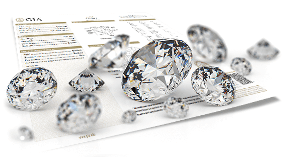

# Diamonds price prediction
**Ironhack's Kaggle competition**

The repository describes the steps followed in the Kaggle competition about diamonds price prediction, launched by Ironhack 
as project for the third module, involving Machine Learning.

---

On the notebook attached you can find the steps I took while taking part of this competition. I decided to use Decision
Tree Classifier in order to attach a tag to each diamond, not having in count price (since is the feature to be predicted).

After that, I used Light Gradient Boost Machine (LGBM), focussed on regression in order to infer the price.

The model results after cross validation is around 530.3 RMSE

